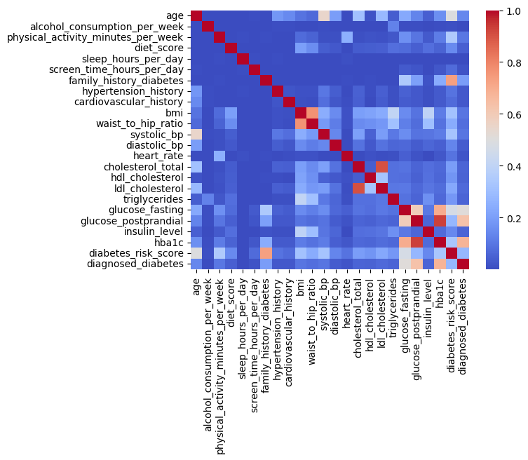
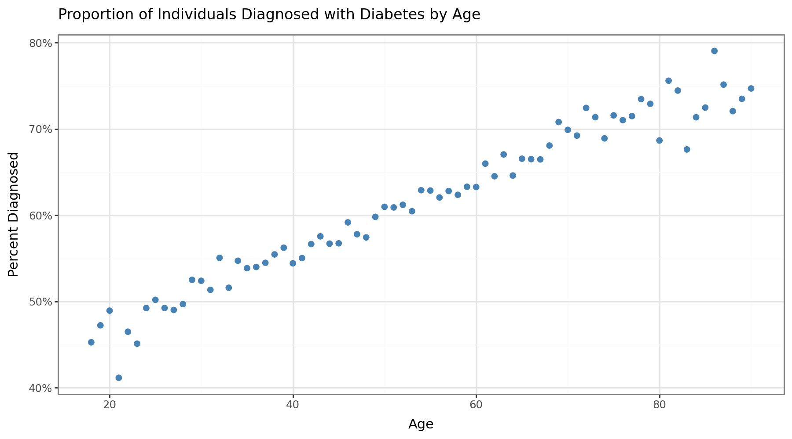
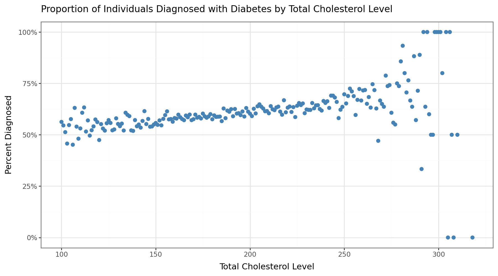
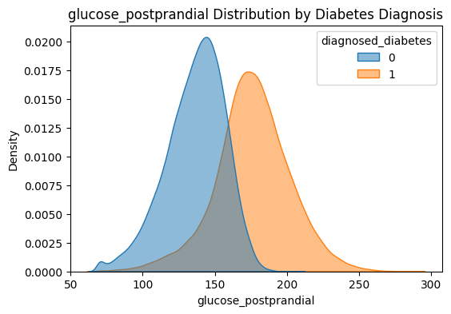
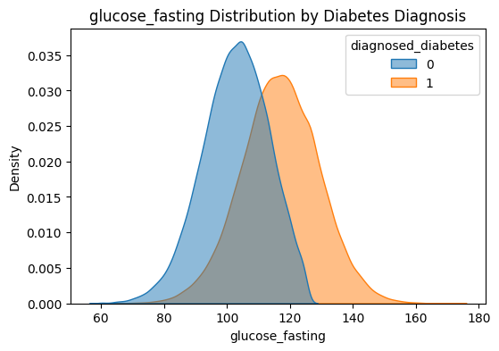
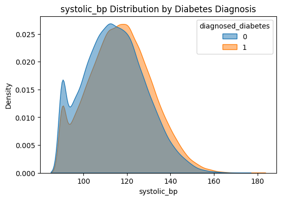
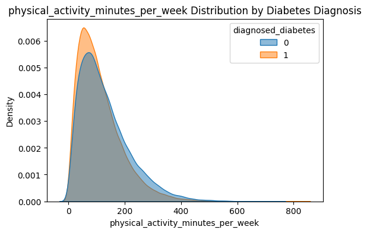

## What is your dataset and why did you choose it?

This dataset contains information about individuals who have been diagnosed with diabetes. Each row represents a patient. There are many features that contain information that pertains specifically to the patient's personal health readings/data. There are also some information that provides background on the patient's history or family history, as well as social information.

I chose to work with this dataset because I have and have had family members that have been diagnosed with diabetes, so I am interested in seeing which features seem to be the best predictors of a positive diabetes diagnosis. If at all possible, I would also like to see if I can not only just predict if an individual will be diagnosed with diabetes well, but which type of diabetes they will be diagnosed with.

## What did you learn from your EDA?

From my EDA, I learned that there are many factors that seem to have similar distributions between those with diabetes and those without. These features may not be as important or valuable in any model I am to make with this data. On the flip side of that, the features _glucose_postprandial_ and _glucose_fasting_ seemed to have distinct distributions for those with diabetes versus those without, so I plan on investigating these further.

I also found that when splitting up inidividuals into some categories (such as _ethnicity_ and _family_history_diabetes_), the proportions of those individuals in each category with diabetes always fell near 60%, which is interesting and inidicates to me that this dataset may not contain the best data since it might be altered to ensure that those proportions are present.

## What issues or open questions remain?

As I mentioned earlier, I am concerned that this dataset might not be the best to use because of the odd proportions I have found. I may need to consider finding a different dataset that certainly has more accurate data points. I also need to further investigate which features I would like to add to my model.

## Visualizations

#### Correlation

This plot highlights the correlation matrix between a set of the features in the dataset. Using this, I was able to remove some features that are highly correlated. Some of these features seemed to serve as a sanity check. For instance, _ldl_cholesterol_ and _hdl_cholesterol_ seemed to be correlated, which makes sense. I ended up removing both since _total_cholesterol_, another feature in the model, is calculated using the previous two.

#### Trends

###### Proportion of those Diagnosed with Diabetes by Age

I anticipated this trend because I had anecdotally assumed that individuals who have lived longer may have experienced more health complications, have had more time for the compounding lifestyle choices, and have had more chances to develop diabetes.

###### Proportion of those Diagnosed with Diabetes by Total Cholesterol Level

This trend intrigues me, and I intend to look more into what is causing it.

#### Distributions

Some distributions are bimodal until split on those diagnosed with diabetes. Others, seemed to overlap. Here are a few examples.

